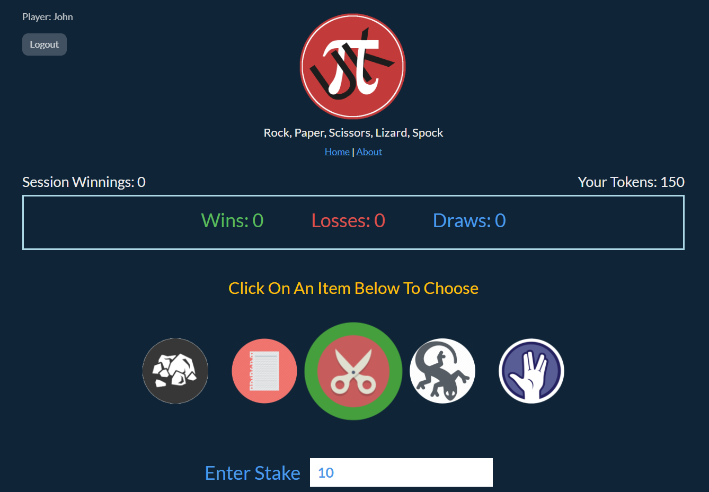

<!-- PROJECT LOGO -->
<br />
<p align="center">
  <a href="https://github.com/piyook/roshambo">
    
  </a>

  <h3 align="center">Rock, Paper, Scissors, Lizard, Spock Game</h3>

  <p align="center">
    A simple demo app based on Roshambo (rock, paper, scissors) using Vue-3 and Laravel
    <br />
    <a href="https://github.com/piyook/roshambo"><strong>Explore the docs »</strong></a>
    <br />
    <br />
    <a href="http://roshambo-lb-637952140.eu-west-2.elb.amazonaws.com/">View Demo</a>
  </p>
</p>


<!-- TABLE OF CONTENTS -->
<details open="open">
  <summary><h2 style="display: inline-block">Table of Contents</h2></summary>
  <ol>
    <li>
      <a href="#about-the-project">About The Project</a>
      <ul>
        <li><a href="#built-with">Built With</a></li>
      </ul>
    </li>
    <li>
      <a href="#getting-started">Getting Started</a>
      <ul>
        <li><a href="#prerequisites">Prerequisites</a></li>
        <li><a href="#installation">Installation</a></li>
      </ul>
    </li>
    <li><a href="#usage">Usage</a></li>
    <li><a href="#contact">Contact</a></li>
  </ol>
</details>


<!-- ABOUT THE PROJECT -->
## About The Project
<p align="center">
 
 </p>
 <br>
 The project is a simple game app based on roshambo (rock,paper,scissors) that 
 has a front-end built with Vue-3 and a back-end API built with Laravel used to record users 
 scores and handle game logic. 

 The vue components are stored in a Vapp folder within the Laravel resources folder.

 Vue-cli was modded to build the VUE production dist folder to the Laravel 
 public folder and also update the app.blade.php which was used to build 
 the index.html file. In this use-case the laravel blade templating engine is 
 not being used.
 
 All url routes are redirected to index.html to allow Vue-Router to serve the 
 Vue pages but still allows Laravel to work in the backend.

 SPA Authorization is achieved using Laravel Fortify and SPA Authentication
 using Laravel Sanctum making use of session and http cookies (possible 
 because the API is on the same url as the web app otherwise CORS issues
 would force the use of authorization headers instead of cookies).

 The project was developed in, and deployed, using Docker containers.


### Built With

* Vue-3
* Vite
* Laravel 9
* Docker
* Bootswatch


## Getting Started

The project can be built and run in docker local containers for convenience.

### Prerequisites

Node.js and Docker with Docker-Compose need to be installed.


### Installation

1. Clone the repo
   ```sh
   git clone https://github.com/piyook/roshambo.git
   ```

2. In the env folder use the mysql.env.example to add chosen credentials to 
create the mySQL database container. Rename this file mysql.env.

3. In the src folder create the Laravel .env file using the .env.example as a guide,
adding in your database credentials from step 2.


## Usage

install dependencies

  ```sh
  docker-compose run --rm composer install
  ``` 

migrate empty database to the MySQL container 

   ```sh
  docker-compose exec php php artisan migrate
  ``` 
  
get the containers up and running

  ```sh
  docker-compose up -d server
  ``` 
The app can be accessed from http://localhost


## Contact

Piyook - [@piyookD](https://twitter.com/piyookD) - email piyook@piyook.com

Project Link: [https://github.com/piyook/roshambo](https://github.com/piyook/roshambo)


